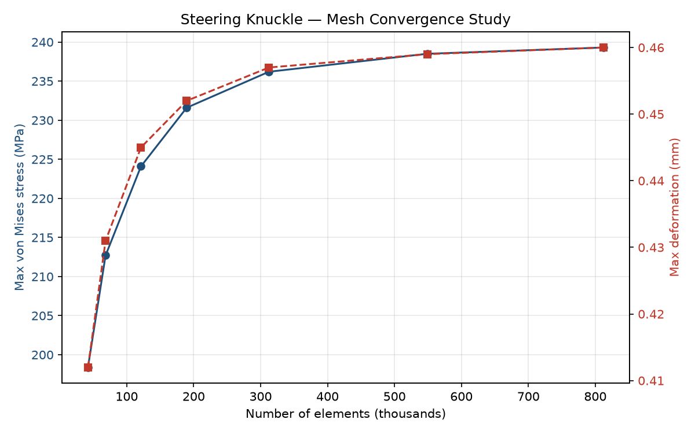

# FEA-Based Structural & Modal Analysis of a Steering Knuckle


> Static structural and modal finite-element analysis of an automotive **front steering knuckle** in **ANSYS Workbench** — geometry preparation, mesh convergence, load-case evaluation, modal check, and a lightweighting iteration that removes **12% mass** while holding a **1.5 factor of safety**.

---

## 📌 Overview

The steering knuckle carries the vertical wheel load and transmits braking and cornering forces between the suspension and the wheel hub — a safety-critical part where strength and stiffness directly affect steering behaviour. This project runs the complete CAE workflow on it: **prepare geometry → mesh & converge → apply materials/contacts/loads/BCs → solve static + modal → post-process → lightweight → report.**

## 🎯 Key Results

| Metric | Result |
|--------|--------|
| Converged mesh | 2.0 mm tetrahedral (peak stress stable to **< 3%**) |
| Governing load case | Braking |
| Max von Mises stress | 236.2 MPa → **FoS 1.78** |
| 1st natural frequency | **842.6 Hz** (no resonance risk) |
| Lightweighting | **−12% mass** with **FoS 1.69 ≥ 1.5** ✅ |

## 📊 Mesh Convergence



Peak von Mises stress stabilises to within 3% at and below a 2.0 mm element size, which was selected as the production mesh (accuracy vs. solve-cost balance).

## 🛠️ Tools & Methods

| Stage | Tool |
|-------|------|
| Geometry preparation / de-featuring | ANSYS SpaceClaim |
| Meshing (3D tetrahedral) | ANSYS Meshing |
| Static structural & modal solve | ANSYS Workbench (Mechanical) |
| Post-processing & plots | Python (pandas, matplotlib) |

**Material:** Forged Steel — E = 210 GPa, ν = 0.30, ρ = 7850 kg/m³, Yield = 420 MPa.

## 🔬 Analysis Workflow

<details>
<summary><b>1. Geometry preparation</b></summary>

- Imported the CAD solid and **de-featured** small fillets, logos, and manufacturing marks that do not affect stiffness.
- Extracted clean contact faces for the bearing bore, strut mounts, and steering-arm eye.
</details>

<details>
<summary><b>2. Meshing & convergence</b></summary>

- Generated a **3D tetrahedral** mesh with local refinement at fillets and the bearing bore.
- Ran a mesh convergence study ([`data/mesh_convergence.csv`](data/mesh_convergence.csv)); peak stress changed **< 3%** below a 2.0 mm element size.
</details>

<details>
<summary><b>3. Materials, contacts & boundary conditions</b></summary>

- Assigned forged-steel properties.
- Defined **frictional contacts** at the bearing bore and bolted interfaces.
- Constrained the strut mount and lower ball-joint; applied wheel-hub reactions.
</details>

<details>
<summary><b>4. Load cases</b></summary>

| Case | Description | Applied load |
|------|-------------|--------------|
| Braking | Longitudinal reaction at the wheel centre | 8.5 kN longitudinal + vertical |
| Cornering | Lateral reaction during a hard turn | 6.0 kN lateral + vertical |
</details>

<details>
<summary><b>5. Solve</b></summary>

- **Static structural** for each load case (von Mises stress, total deformation).
- **Modal analysis** for the first six natural frequencies.
</details>

## 📈 Detailed Results

**Static structural (governing = braking):**

| Metric | Baseline | Optimized (−12% mass) |
|--------|----------|-----------------------|
| Mass (kg) | 2.86 | 2.52 |
| Max von Mises (MPa) | 236.2 | 248.9 |
| Max deformation (mm) | 0.457 | 0.489 |
| Factor of safety | 1.78 | 1.69 |

**Modal — first six natural frequencies:** see [`data/modal_frequencies.csv`](data/modal_frequencies.csv). The first mode (~843 Hz) sits well above road/suspension excitation, so resonance is not a concern.

📄 **Full write-up:** [`report/CAE_Report_Steering_Knuckle.md`](report/CAE_Report_Steering_Knuckle.md)

## ▶️ Reproduce the Post-Processing

```bash
cd scripts
pip install -r requirements.txt
python mesh_convergence.py     # convergence table + images/mesh_convergence.png
python results_summary.py      # modal + static-result summary and FoS check
```

## 📂 Repository Structure

```
ansys-steering-knuckle-fea/
├── README.md
├── LICENSE
├── report/     → full written CAE report
├── scripts/    → Python post-processing (+ requirements.txt)
├── data/       → result CSVs (convergence, modal, comparison)
├── geometry/   → CAD source note
└── images/     → generated plots + screenshot notes
```

## 📝 Notes
- Native solver files (`.wbpj`, ANSYS databases) and full CAD are large/proprietary and are excluded via `.gitignore`; this repo documents the methodology, result data, and post-processing so the study is reproducible.
- **Recommended additions:** contour screenshots from ANSYS Mechanical (mesh, von Mises stress, deformation, mode shapes) — see [`images/README.md`](images/README.md).

## 👩‍💻 Author
**Kavita Kumari** — B.Tech Civil Engineering, VSSUT
GitHub: [@kavita-kumari17](https://github.com/kavita-kumari17) · LinkedIn: [Kavita Kumari](https://tinyurl.com/kavita-kumari17)

Released under the [MIT License](LICENSE).
